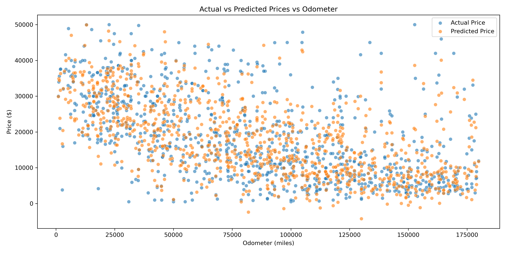
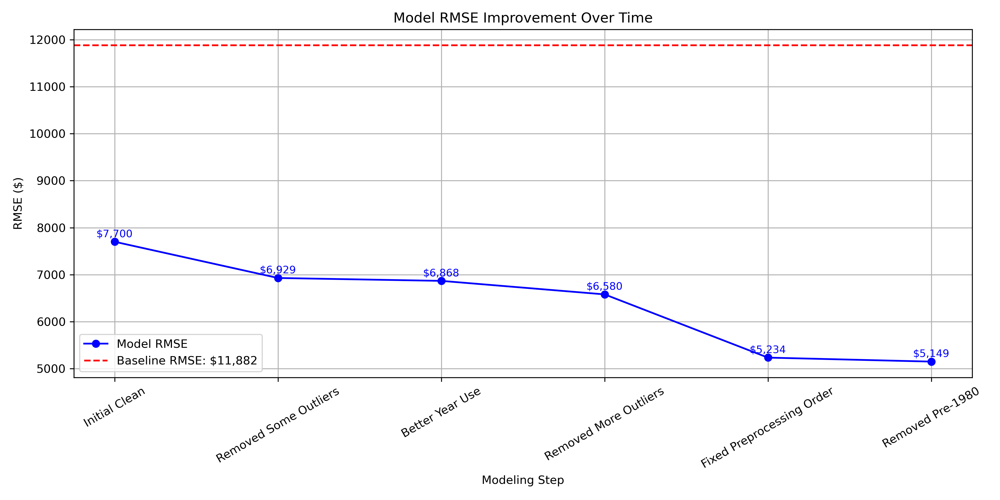

# Practical Application II
Notebook can be found here: https://github.com/lorigreensmith06/AI_ML_CLASS_practical_application_II_used_cars/blob/main/practical_application_II_starter/prompt_II.ipynb

 ## 1. Business Understanding

Objective:
Used car dealers need to accurately price vehicles to:

- Maximize profits

- Reduce inventory turnaround time

- Offer competitive and fair trade-in values

However, pricing is complex — it’s affected by many variables such as year, mileage, model, and condition. This project aims to create a model that helps dealers estimate used car values more reliably based on listing features, improving consistency and pricing decisions.

## 2. Data Cleaning and Preparation

Steps taken:

- Replace the empty values for the following features with mode values: 
**fuel**, **title_status**, **transmission**, **drive**, **paint_color**, **condition**, **type**_
- Replace the empty values for the following features with median values: **odometer**, **year**
- Dropped the following features:
**region**, **cylinders**, **size**, **id**, **VIN**
- Encoded the follow features using the James-Stein Encoder:
**fuel**, **paint_color**, **type**, **condition**, **state**, **model**, **manufacturer**
- The following features also had one-hot encoding applied using get_dummies: 
**title_status**, **transmission**, **drive**
- Removed listings with prices **under $500** or **over $50,000**
- Eliminated extreme odometer values (under **500** or over **180,000** miles)
- Removed vehicles manufactured before **1980** (to exclude classic/collector cars)
- Dropped entries with missing or inconsistent values

**Created new features:**

- **miles_per_year** to normalize usage across different vehicle ages

- **avg_price_for_year** to reflect general depreciation patterns

**Final dataset size: 320,300 cleaned records (from original 426,880)**

## 3. Modeling - Descriptive and Inferential Statistics
Several type of models were implemented.  

- Regression, Polynomial degree 2
- Ridge, Polynomial degree 2
- Lasso, Polynomial degree 2

Key Points About Models: 
- Interestingly, all of the models performed similarly with the data.
- Making Polynomial degree 2 improved the models.
- Adding features tended to help the models.
- Taking features away tended to hurt the models (except region which I decided to drop).

| Metric                | Value      |
|-----------------------|------------|
| Average vehicle price (cleaned) | ~$20,000 |
| Odometer range | 500 – 250,000 miles
| Most common vehicle years | 2005–2020 |

Key relationships observed:

- Higher mileage and older vehicles are consistently priced lower

After removing outliers, year, model, and mileage-based features became more important

## 4. Evaluation - Modeling Findings & Interpretation

### Key Findings:

| Metric                | Value      |
|-----------------------|------------|
| **Baseline RMSE**     | $11,882.19 |
| **Final Test RMSE**   | $5,149.40  |
| **Cross-validated RMSE** | $5,209.47  |
| **Error Reduction**   | ~57%       |

This means the model can estimate prices with an average error of ~$5,100 — a significant improvement over just guessing the average price.

## 5. Deployment - Actionable Business Recommendations

| Top Features That Drive Price| Value |
-------------------------------|-------|
| **Odometer** | Cars with higher mileage tend to sell for less |
| **Miles per Year** | Helps identify vehicles that are over- or under-used for their age |
| **Vehicle Year** | Newer vehicles generally command higher prices |
| **Model** | Some models retain value better than others |
| **Average Price for Year** | Reflects depreciation and market trends |

Used car dealers can apply these insights to:

- Price Smarter:
Use the model to help price trade-ins and new inventory based on mileage and age

- Improve pricing consistency across sales teams

- Stock Strategically:
Focus on vehicle years and models where the model performs best (2000–2022, mainstream brands)

- Avoid high-mileage or very old cars that are harder to price reliably

- Support Sales and Training:
Use insights to train new staff on what features most influence price

- Give customers data-backed explanations for trade-in valuations